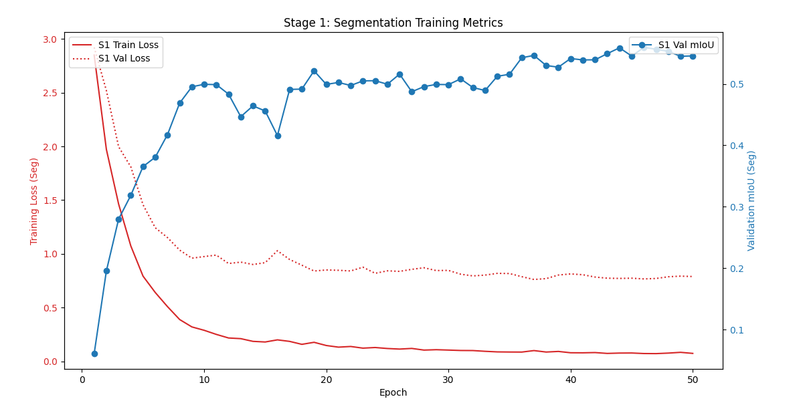
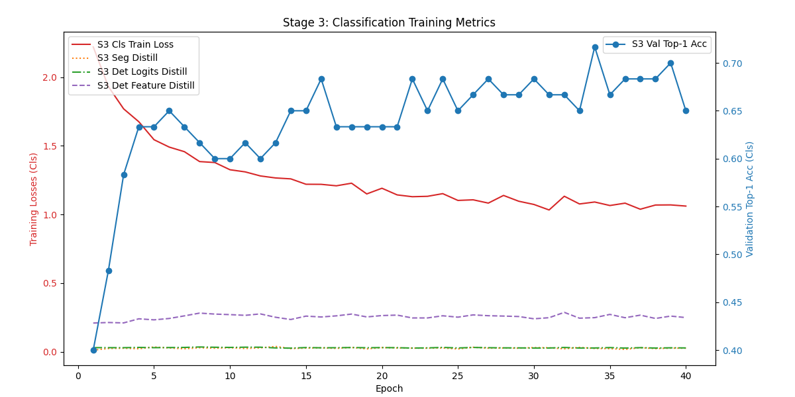

# Unified-OneHead Multi-Task Learning Model

## Project Overview

This project addresses a multi-task learning challenge: to develop a neural network model with a **single shared head** capable of simultaneously performing **Object Detection**, **Semantic Segmentation**, and **Image Classification**. A core objective is to design an efficient model architecture and training strategy that minimizes **Catastrophic Forgetting** when learning these tasks sequentially. The goal is to ensure that after learning all tasks, the performance drop for each task is no more than 5% compared to its individual training baseline.
* [Github](https://github.com/VanLinLin/DL_Homework)

## Datasets

The project utilizes three distinct mini-datasets, ensuring no overlap between them:
* **Object Detection**: Mini-COCO-Det (based on COCO 2017, 10 classes, 240 training / 60 validation images).
* **Semantic Segmentation**: Mini-VOC-Seg (based on PASCAL VOC 2012, 20 foreground classes, 240 training / 60 validation images).
* **Image Classification**: Imagenette-160 (a subset of Imagenette v2, 10 classes, 240 training / 60 validation images).

All input images are uniformly resized to 512x512 pixels.

## Model Architecture (`models.py`)

The model follows a general Encoder-Decoder structure, comprising a Backbone, Neck, Shared Head, and Task-specific Output Layers.

1.  **Backbone**:
    * The feature extraction part of **EfficientNet-B0** (pre-trained on ImageNet) is used as the backbone.
    * It extracts multi-scale feature maps; specifically, outputs from `features[5]` (s16 resolution, 112 channels) and `features[8]` (s32 resolution, 1280 channels) are utilized by the Neck.

2.  **Neck**:
    * Fuses s16 and s32 features from the backbone.
    * The s32 feature map is upsampled (bilinear interpolation) to s16 resolution and then concatenated with the s16 feature map from the backbone.
    * The concatenated features (1392 channels) are processed by two convolutional layers: a 1x1 convolution (reducing channels to 512) followed by a 3x3 convolution (reducing channels to 256).
    * The Neck outputs a 256-channel, s16 resolution feature map to the Shared Head.
    * This design adheres to the "$\le2$ conv/BN/ReLU layers or a single FPN layer" constraint.

3.  **Shared Head**:
    * Consists of **three 3x3 convolutional layers**, each maintaining 256 input/output channels and including Batch Normalization and ReLU activation.
    * This shared head processes features from the Neck to generate a common representation for all tasks.
    * It meets the "2-3 layers (Conv or MLP) and single branch" constraint.

4.  **Task-specific Output Layers**:
    * All task outputs originate from the final feature map of the Shared Head (`shared_feat_conv3`).
    * **Semantic Segmentation**: A 1x1 convolutional layer projects the shared features to `num_segmentation_classes` channels, followed by bilinear interpolation to the original input image size.
    * **Object Detection**: To enhance representational capacity, the detection head uses **two sequential 1x1 convolutions** (interspersed with BN and ReLU: `Conv1x1(256->128) -> BN -> ReLU -> Conv1x1(128->output_channels)`). It produces YOLOv1-style predictions (bounding box coordinates, confidence score, and class probabilities per grid cell).
    * **Image Classification**: A Global Average Pooling (GAP) layer followed by a Linear (fully connected) layer outputs logits for each class.

5.  **Parameters & Constraints**:
    * The total number of trainable parameters in the model is approximately 7.68M, which is within the < 8M limit.

## Training Strategy (`train.py`)

A **Single Pass Sequential Learning** strategy was adopted, with the tasks learned in the order: Segmentation -> Detection -> Classification. Key techniques include Knowledge Distillation and Differential Learning Rates.

1.  **Knowledge Distillation (LwF - Learning without Forgetting)**:
    * When learning a new task, a "teacher model" (the model state after training the previous task) guides the "student model" (current model) to retain old knowledge.
    * **Segmentation Distillation**: Uses KL Divergence loss between the softmax outputs (adjusted by temperature T) of the student and segmentation teacher model on replay data.
    * **Detection Distillation**:
        * **Logits Distillation**: Uses MSE loss between the raw detection head outputs of the student and detection teacher model on replay data.
        * **Feature Distillation**: Additionally uses MSE loss between the feature maps from the last shared head layer (`head_shared_conv3`) of the student and detection teacher model on replay data.
    * **Classification Distillation**: When other tasks are primary, KL Divergence loss is used to distill knowledge from the classification teacher's output head.
    * **Replay Buffer**: A small replay buffer (batch size 8, randomly sampled from the training set of previous tasks) is used to provide data for calculating distillation losses when training new tasks.

2.  **Differential Learning Rates**:
    * To protect learned knowledge (especially in the backbone and early shared layers) while adapting to new tasks, different learning rates are set for various parts of the model.
    * **Strategy**: When a task is the primary learning objective of a stage, its specific head and the final shared convolutional layer (`head_shared_conv3`) receive the full base learning rate for that stage (factor 1.0). Deeper shared layers (backbone, neck, early/mid shared head layers) use significantly reduced learning rate factors (e.g., 0.001 to 0.05). Task heads being distilled also use a reduced learning rate factor (e.g., 0.1 to 0.2).
    * Implemented via the `get_optimizer_with_differential_lr` helper function.

3.  **Optimizer & Scheduler**:
    * Optimizer: AdamW (with weight_decay=1e-4).
    * Scheduler: `ReduceLROnPlateau`, adjusting the learning rate based on the validation metric of the current primary task.

4.  **Data Augmentation**:
    * Training data for all tasks undergoes resizing (to 224x224) and random horizontal flipping.
    * `transforms.ColorJitter` (brightness, contrast, saturation, hue) is applied to the training set images to improve model generalization.

5.  **Other Training Details**:
    * Mixed Precision Training (AMP) is used for faster training on compatible GPUs.
    * Global random seeds (NumPy, PyTorch, Python random) are set for reproducibility.

### Key Hyperparameter Reference (from a successful run):

* **Learning Rate Factors (examples, need tuning per stage)**:
    * `factor_backbone_preserve = 0.005`
    * `factor_neck_preserve = 0.01`
    * `factor_shared_early_preserve = 0.01`
    * `factor_shared_mid_preserve = 0.05`
    * `factor_main_task_related_shared_late = 1.0` (for `head_shared_conv3` when serving the main task)
    * `factor_main_task_head = 1.0` (for the main task's specific head)
    * `factor_distill_head = 0.2` (for distilled task heads)
* **Distillation Weights (examples)**:
    * `distill_weight_seg = 4.0`
    * `distill_weight_det_logits = 5.0`
    * `distill_weight_det_feature = 2.5`
    * `distill_weight_cls = 1.0`
    * `distill_temp = 2.0`
* **Epochs per Stage (example for single pass)**: S1 (Seg): 50, S2 (Det): 70, S3 (Cls): 40.
* **Base Learning Rates per Stage (example)**: S1: 1e-4, S2: 1e-4, S3: 1e-4.

*Note: The hyperparameters above are references from a successful experiment and may require further tuning for optimal performance under different conditions.*

## Evaluation (`eval.py`)

An `eval.py` script is provided for evaluating the trained model.

* **Metrics**:
    * Semantic Segmentation: mIoU (Mean Intersection over Union)
    * Object Detection: mAP@0.5 (Mean Average Precision at IoU threshold 0.5)
    * Image Classification: Top-1 Accuracy
* **Usage**:
    ```bash
    python eval.py \
        --weights <path_to_your_final_model.pt> \
        --data_root <path_to_data_directory> \
        --tasks all \
        --base_miou <S1_baseline_mIoU> \
        --base_map <S2_baseline_mAP> \
        --base_top1 <S3_baseline_Top1>
    ```
    The `--base_...` arguments are the peak performances of each task from their respective training stages, used to calculate the forgetting drop.

## Final Results (from a successful single-pass run)

Using the single-pass sequential learning strategy with knowledge distillation (including feature distillation for detection) and refined differential learning rates, the model successfully met the catastrophic forgetting criterion (performance drop $\le 5\%$) for all three tasks:
* **Segmentation (mIoU)**: Baseline (S1) 0.5594, Final (S3 model) 0.5452, **Drop: 2.55% (MET)**
* **Detection (mAP@0.5)**: Baseline (S2) 0.0199, Final (S3 model) 0.0205, **Drop: -3.00% (Improved, MET)**
* **Classification (Top-1 Acc)**: Baseline (S3) 0.7167, Final (S3 model) 0.7167, **Drop: 0.00% (MET)**

<table>
  <tr>
    <td align="center">
      
      <br><sub>Stage 1: Segmentation Metrics</sub>
    </td>
    <td align="center">
      
      <br><sub>Stage 2: Detection Metrics</sub>
    </td>
    <td align="center">
      
      <br><sub>Stage 3: Classification Metrics</sub>
    </td>
  </tr>
</table>


## How to Run

1.  **Environment Setup**:
    * Python 3.x
    * PyTorch, Torchvision
    * Torchmetrics
    * NumPy, PIL (Pillow)
    * tqdm, Matplotlib (for plotting logs)
2.  **Data Preparation**:
    * Download and extract the three mini-datasets (Imagenette-160, Mini-COCO-Det, Mini-VOC-Seg) into the specified `data_root` directory, maintaining their original subdirectory structure.
3.  **Model Definition**:
    * The `models.py` file contains the `UnifiedMultiTaskModel` definition. Ensure it's the latest version (with the optimized Neck and, if used, the deeper detection head).
4.  **Training**:
    * Execute `python train.py`. The training log will be saved (e.g., to `training_log_single_pass.txt`).
    * The best model from each stage and the final model will be saved as `.pt` files (e.g., `model_s1_best.pt`, `model_s2_best.pt`, `model_final_best_1pass.pt`).
5.  **Evaluation**:
    * Use the `eval.py` script, providing the path to your trained final model and the baseline performance values for each task (obtained from the training log).
    ```bash
    python eval.py --weights model_final_best_1pass.pt --data_root DL_data/ --tasks all --base_miou <S1_mIoU> --base_map <S2_mAP> --base_top1 <S3_Top1>
    ```
6.  **(Optional) Plotting Training Logs**:
    * Use the `eval.py` script, providing the path to your trained final model and the baseline performance values for each task (obtained from the training log).
    (Ensure the correct training log filename is specified in the script if it's not `training_log.txt`).

## File Structure (Recommended)
```bash
your_project_directory/
├── DL_data/                      # Root directory for datasets
│   ├── imagenette-160/
│   ├── mini_coco_det/
│   └── mini_voc_seg/
├── models.py                     # Model definition
├── train.py                      # Main training script
├── eval.py                       # Evaluation script
├── plot_log.py                   # (Optional) Script for plotting logs
├── model_s1_best.pt              # (Generated during training)
├── model_s2_best.pt              # (Generated during training)
├── model_final_best_1pass.pt     # (Generated during training - final model)
├── training_log_single_pass.txt  # (Generated during training)
├── plots/                        # (Generated by plot_log.py)
│   ├── stage1_segmentation_metrics.png
│   ├── stage2_detection_metrics.png
│   └── stage3_classification_metrics.png
└── README.md                     # This file
```

I used google gemini to assist in this assignment. [History](https://g.co/gemini/share/fca23d5853e4)